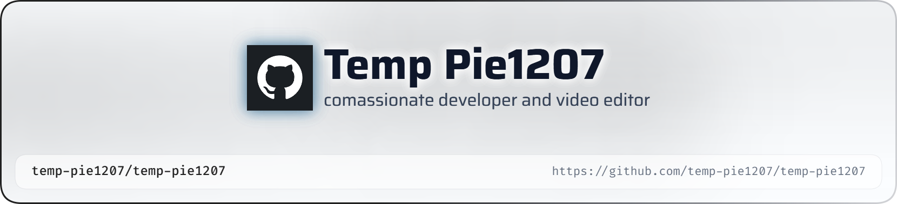

<picture>
   <source media="(prefers-color-scheme: dark)" srcset="art/header-dark.png">
   
</picture>

# Hey there, I'm **temp-pie** 👋

### 🚀 Full Stack Developer | DSA Enthusiast | UI/UX Explorer

 

---

# 💖 About Me

<table>
<tr>

<td width="65%">

## 👨‍💻 Who Am I?

🔭 **Currently Working On**
- Full Stack Web Applications
- Personal Portfolio
- Modern UI/UX Projects

🌱 **Currently Learning**
- Next.js
- TypeScript
- Three.js
- GSAP
- AI Integration
- Cloud Technologies

👯 **Looking to Collaborate On**
- Open Source Projects
- Startup Ideas
- AI Applications
- Modern Web Platforms

💬 **Ask Me About**
- JavaScript
- TypeScript
- React
- Next.js
- Node.js
- Express.js
- MongoDB
- Firebase
- Tailwind CSS
- DSA
- Git & GitHub

🎯 **Current Goals**

- 🚀 Become an Elite Full Stack Developer
- 🌍 Contribute to Open Source
- 💼 Land a Top Software Engineering Role
- 🏆 Master DSA & System Design
- ✨ Build Award-Winning Websites

⚡ **Fun Fact**

I enjoy transforming creative ideas into premium digital experiences and solving challenging DSA problems.

</td>

<td width="35%" align="center">

</td>

</tr>
</table>

---

# ⚡ Tech Stack

### Languages

### Frontend

### Backend

### Database

### Cloud & DevOps

### Tools

---

# 📈 GitHub Analytics

  

---

# 🏆 GitHub Achievements

---

<h2 align="center">🐍 Contribution Snake</h2>

  <picture>
    <source
      media="(prefers-color-scheme: dark)"
      srcset="https://raw.githubusercontent.com/temp-pie1207/temp-pie1207/output/github-contribution-grid-snake-dark.svg"
    />
    <source
      media="(prefers-color-scheme: light)"
      srcset="https://raw.githubusercontent.com/temp-pie1207/temp-pie1207/output/github-contribution-grid-snake.svg"
    />
    
  </picture>

---

# 🌐 Let's Connect

---

# 📚 Currently Learning

---

## 💭 Developer Quote

> **"I don't just build websites—I craft digital experiences that combine performance, creativity, and innovation."**

---

